# Sea Surface Height Prediction Using Different Neural Network Frameworks

[]()
[]()
[]()

---

## Overview

This repository investigates how different neural network architectures and their intrinsic inductive biases influence sea surface height (SSH) forecasting over the South China Sea (SCS). We systematically evaluate three representative spatiotemporal forecasting frameworks and propose two strategies — **input masking** and **geostrophic constraint** — to improve SSH prediction accuracy.

| Model | Category | Key Feature |
|:------|:---------|:------------|
| SimVPv2 | CNN-based | Gated Spatiotemporal Attention (gSTA) |
| PredRNNv2 | RNN-based | Spatiotemporal Memory LSTM, Autoregressive |
| PredFormer | Transformer-based | Factorized Temporal-Spatial Self-Attention |

### Model Architectures

<p align="center">
  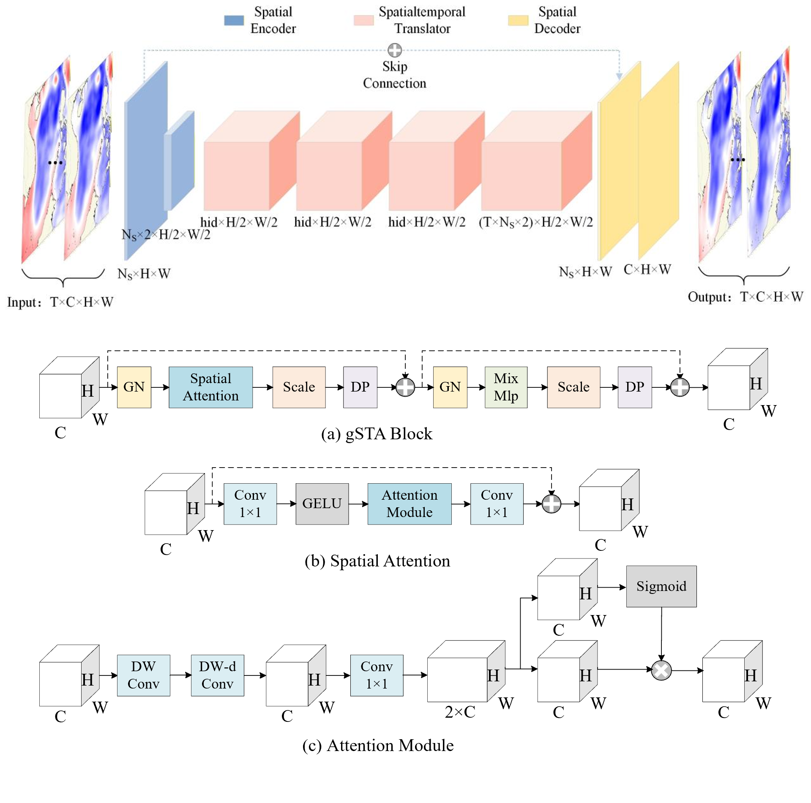
  <br>
  <em>Figure 1. SimVPv2 architecture: Encoder-Translator-Decoder with gSTA blocks (adapted from Tan et al., 2024).</em>
</p>

<p align="center">
  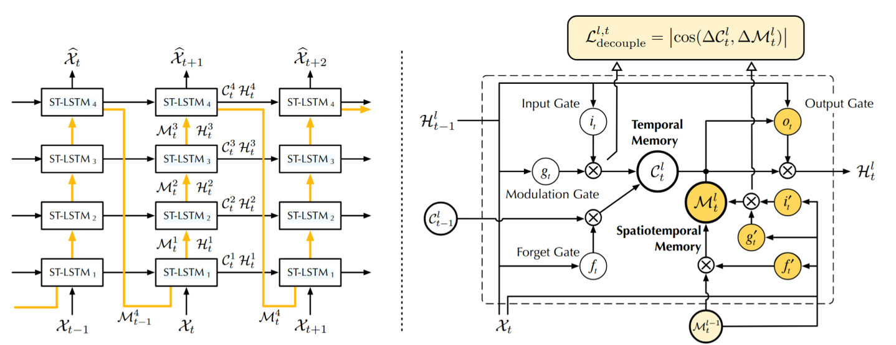
  <br>
  <em>Figure 2. PredRNNv2 architecture: ST-LSTM with spatiotemporal memory flow (adapted from Wang et al., 2023).</em>
</p>

<p align="center">
  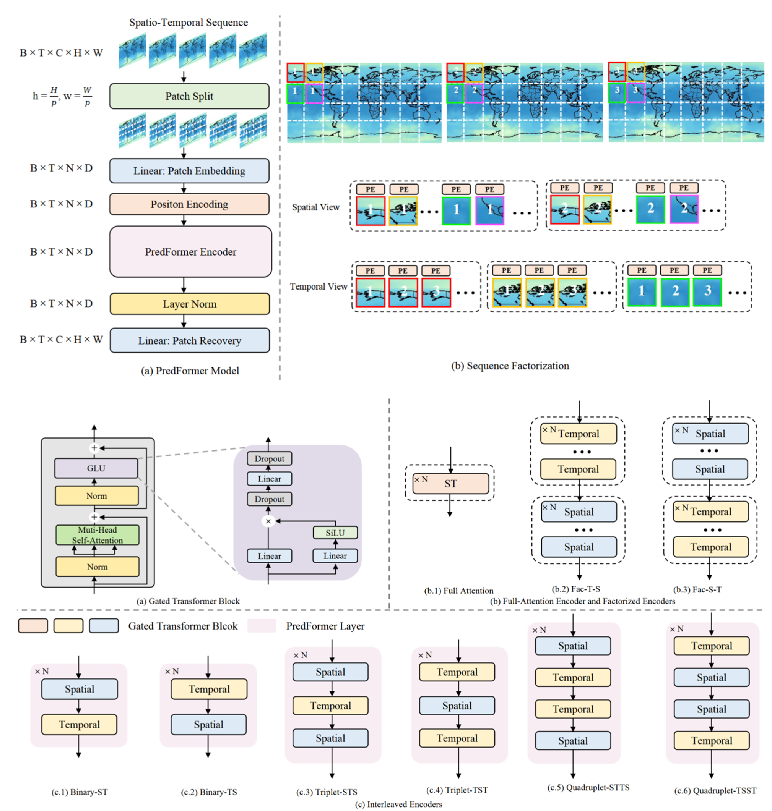
  <br>
  <em>Figure 3. PredFormer architecture: Factorized Temporal-Spatial gated Transformer (adapted from Tang et al., 2025).</em>
</p>

---

## Key Results

Two core strategies are proposed and validated:

### 1. Mask Input(MI)

Ocean datasets contain invalid values over land regions. We propose concatenating a binary land-ocean mask as an additional input channel to explicitly guide feature extraction. For the autoregressive PredRNNv2, the mask is applied at every time step to prevent error accumulation.

<p align="center">
  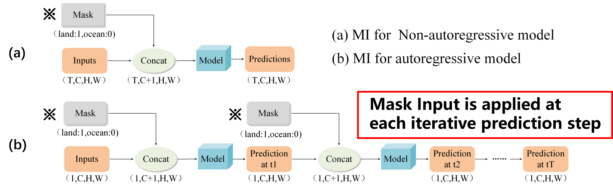
  <br>
  <em>Figure 4. Input mask strategy in non-autoregressive (top) and autoregressive (bottom) models.</em>
</p>

### 2. Geostrophic Constraint(GC)

Since SSH forecasting lacks an explicit analytical equation linking inputs and outputs, conventional PINN methods cannot be directly applied. We propose a **geostrophic constraint** that computes geostrophic velocity fields from both predicted and target SSH, then minimizes their difference:

$$
Loss = Loss_{data} + \lambda \cdot Loss_{geo}
$$

where $Loss_{data}$ is the SSH prediction error, $Loss_{geo}$ is the geostrophic velocity inconsistency, and $\lambda$ controls the constraint strength (optimal: 0.7).

<p align="center">
  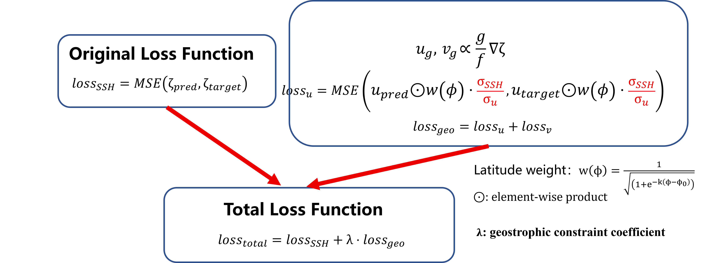
  <br>
  <em>Figure 5. Physics-informed SSH forecasting workflow with geostrophic constraint.</em>
</p>

### Performance Comparison Across All Models and Strategies

The table below summarizes the RMSE (cm) of all three models under different strategy combinations, demonstrating that the effectiveness of each strategy is strongly model-dependent.

| Model | Baseline(+ Loss Mask) | - Loss Mask | + MI | + GC | + MI + GC |
|:------|:---------|:------------|:-------------|:-------------------------|:-------------------|
| SimVPv2 | 2.01 |  1.91(↓5.0%) | 1.86 (↓7.5%) | **1.79** (↓10.9%) | **1.71** (↓14.9%) |
| PredRNNv2 | 2.03 |  2.15(↑5.9%) | **1.64** (↓19.2%) | 1.91 (↓5.9%) | **1.61** (↓20.7%) |
| PredFormer | 2.21 |  2.25(↑1.8%) | 2.26 (↑2.3%) | 2.49 (↑12.7%) | 2.76 (↑24.9%) |

> **Note on PredRNNv2 results:** The PR model results reported here differ from those in our prior study (Huang et al., 2025), reflecting two key improvements: (1) hyperparameter tuning was adjusted to maintain parameter scale consistency with SimVPv2 (~3–4M) rather than forcing exact parity, yielding a stronger baseline RMSE; and (2) the geostrophic constraint loss is now computed over all 19 forecast steps (including the autoregressive intermediate states) rather than only the 10 output steps as in the previous work, which better aligns with the model's autoregressive training objective.

## Key findings:

**Mask input** benefits autoregressive models most — PredRNNv2 RMSE drops from 2.03 to 1.64 cm (↓19.2%) with negligible computational overhead. The two strategies exhibit **strong synergy** on SimVPv2 and PredRNNv2, with the combined approach achieving the best results.

**Geostrophic constraint** exhibits strongly **architecture-dependent** effectiveness, which we analyze through the lens of *inductive bias compatibility*.

The geostrophic constraint acts as a **first-order spatial gradient regularizer**: it computes the MSE between predicted and target geostrophic velocity fields (derived from SSH spatial gradients via Sobel operators), thereby forcing the model to learn SSH spatial gradient structures during feature extraction. Whether this constraint helps or hurts depends on whether the model's inductive bias naturally supports spatial gradient extraction:

- **SimVPv2** (CNN): Convolution kernels are inherently capable of evolving into discrete differential operators (e.g., Sobel-like gradient filters) during training. The geostrophic constraint provides an explicit gradient supervision signal that guides this natural capability, yielding the largest improvement (↓10.9%).
- **PredRNNv2** (RNN + patching): Although its core units are convolutional, PredRNNv2 employs a **patching** mechanism — a technique that divides an input image into non-overlapping rectangular patches (e.g., 8×8 pixel blocks), then flattens each patch into a one-dimensional vector. This converts a continuous 2D spatial field into a sequence of isolated blocks, partially breaking the pixel-to-pixel adjacency that spatial gradient extraction relies on. However, crucially, after patching, PredRNNv2 does **not** apply global attention — instead, each patch is processed by convolution layers that preserve the spatial relationships between patches. This means the model retains partial spatial continuity: **smaller patches preserve finer spatial granularity, allowing the geostrophic constraint to extract more accurate gradient features**. Furthermore, its autoregressive framework benefits from the constraint's physical meaning — ensuring accurate SSH gradients at each step suppresses temporal error accumulation. The improvement is moderate (↓5.9%).
- **PredFormer** (ViT): PredFormer also uses patching, but crucially, it follows patching with **global self-attention** — a mechanism where every patch attends to all other patches simultaneously, computing weighted correlations across the entire spatial domain. This global aggregation completely discards the original spatial ordering: the model no longer "knows" which patches are neighbors and which are distant. As a result, the local spatial gradient structure required by the geostrophic constraint cannot be faithfully represented in the model's feature space. Imposing the constraint on top of this fundamentally **global** representation causes **over-regularization** — an antagonism between global structure modeling and local gradient supervision that degrades performance (↑12.7%).

**Validation via patch size analysis :** If the patching mechanism is indeed the bottleneck, then reducing patch size should restore spatial continuity and improve geostrophic constraint effectiveness. We validate this by varying PredRNNv2's patch size:

| Patch Size | Without GC | With GC | Improvement |
|:-----------|:-----------|:--------|:------------|
| 16 | 2.50 cm | 2.50 cm | 0% |
| 8 | 1.96 cm | 1.89 cm | 3.6% |
| 4 | 1.90 cm | 1.72 cm | 9.5% |
| 2 | 1.94 cm | 1.66 cm | 14.4% |

The monotonic trend confirms the hypothesis: smaller patches preserve finer spatial structure, enabling the model to better leverage gradient-based physical supervision.

**Constraint coefficient sensitivity:** The optimal $\lambda$ also diverges across architectures. PredRNNv2 peaks at $\lambda=0.7$, while PredFormer's best performance is at $\lambda=0$ (i.e., no constraint at all), further corroborating the inductive bias–constraint compatibility argument.

| $\lambda$ | PredRNNv2 RMSE | PredFormer RMSE |
|:-----------|:---------------|:----------------|
| 0 | 2.03 cm | 2.21 cm |
| 0.1 | 2.04 cm | 2.31 cm |
| 0.5 | 1.97 cm | 2.52 cm |
| 0.7 | **1.91 cm** | 2.49 cm |
| 1 | 1.95 cm | 2.44 cm |
| 5 | 1.98 cm | 2.50 cm |

---

## Model Scale Analysis

Prediction accuracy count does not scale linearly with model parameter. The ViT-based PredFormer is highly sensitive to parameter scale — it degrades severely at 0.21M parameters and overfits at 29.48M. In contrast, SimVPv2 and PredRNNv2 maintain stable performance at small scales thanks to their architectural inductive biases.

<p align="center">
  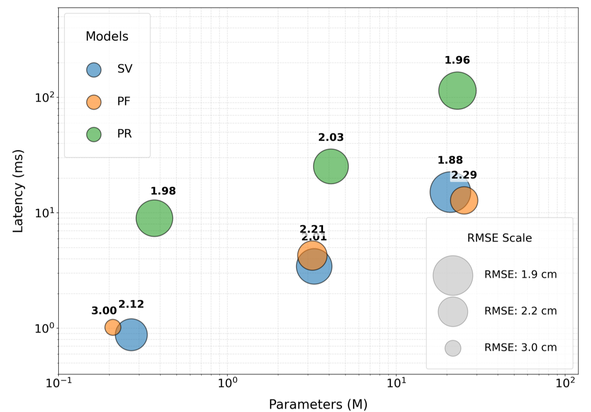
  <br>
  <em>Figure 6. Model performance vs. parameter count. Bubble size represents RMSE (larger = worse). Models with strong inductive biases achieve competitive accuracy at far fewer parameters.</em>
</p>


> For Earth science applications with limited training data (~10k samples), smaller models with appropriate inductive biases are more practical than large-scale models.

---

## Spatiotemporal Error Characteristics

### RMSE vs. Forecast Lead Time

<p align="center">
  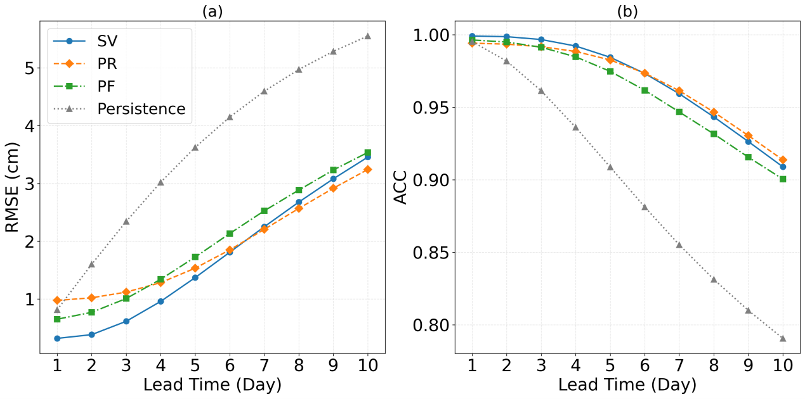
  <br>
  <em>Figure 7. Average RMSE and ACC curves versus forecast lead time (1–10 days).</em>
</p>

- **SimVPv2**: Best short-term (Lead 1–4), lowest initial RMSE
- **PredRNNv2**: Best long-term stability (Lead 6–10), lowest RMSE at Lead 10 (~3.3 cm)
- **PredFormer**: Weaker than the other two, but outperforms Persistence baseline

### Seasonal Characteristics

<p align="center">
  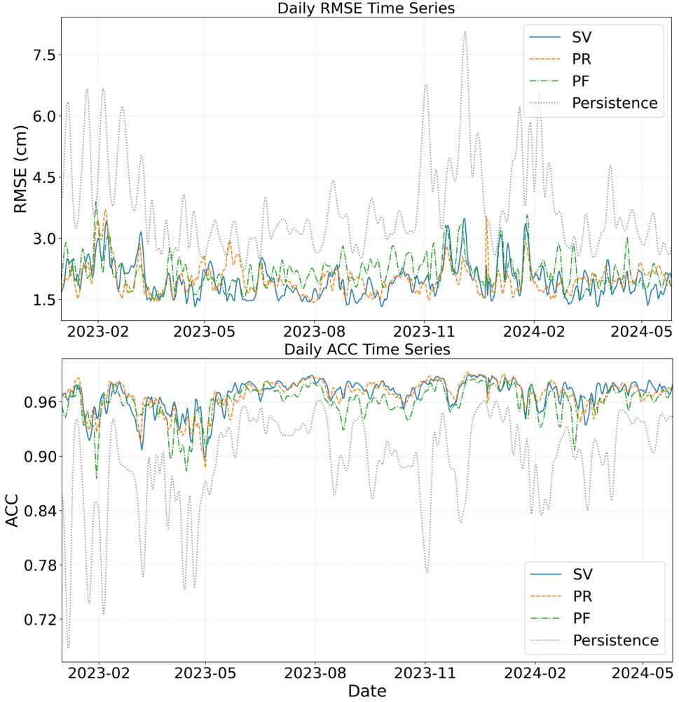
  <br>
  <em>Figure 8. Seasonal average performance metrics heatmap across lead times.</em>
</p>

- Winter RMSE grows faster than summer (higher SSH variability: 9.36 cm vs 7.07 cm)
- Winter ACC decays slower (stronger spatial coherence enables pattern capture)
- Errors concentrate in shallow-water and coastal regions

### Wind-Error Correlation

Since SSH variations in the SCS are primarily driven by wind stress curl via baroclinic Rossby waves, we analyze the Pearson correlation between forecast error and wind speed. The two models show **opposite** correlation patterns at different lead times, suggesting they capture different aspects of SSH variability.

<p align="center">
  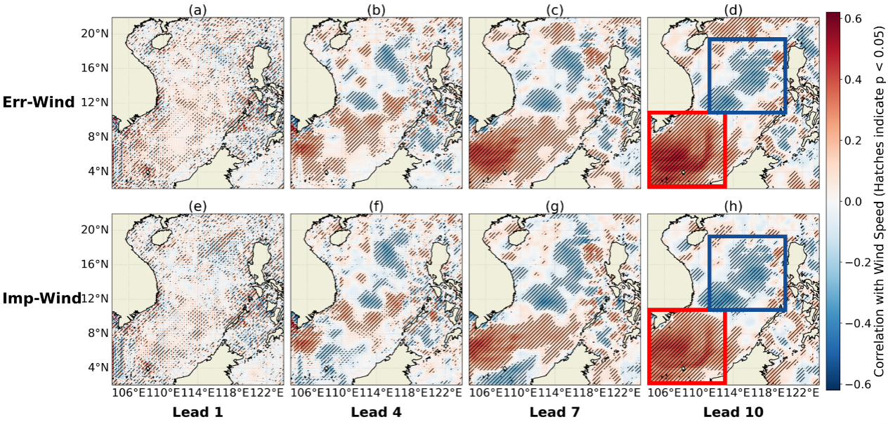
  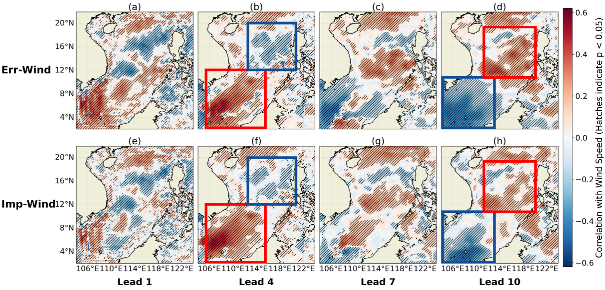
  <br>
  <em>Figure 9. Correlation between forecast error / geostrophic improvement and wind speed. Left: PredRNNv2; Right: SimVPv2. Hatched areas indicate significance at 95% confidence.</em>
</p>

- **PredRNNv2** (autoregressive): Error-wind correlation strengthens gradually with lead time, reflecting a smooth transition from initial-field control to external forcing dominance.
- **SimVPv2** (non-autoregressive): Error-wind correlation stabilizes early (by Lead 4) but shows a **correlation reversal** between Lead 4 and Lead 10, indicating structural inconsistency in long-term extrapolation.

> The complementary error patterns motivate ensemble forecasting.

---

## Ensemble Forecasting

Given the complementary error-wind correlation patterns of PredRNNv2 and SimVPv2, we test ensemble forecasting (simple average of the two models' outputs):

| Configuration | PredRNNv2 | SimVPv2 | Ensemble | Improvement |
|:--------------|:----------|:--------|:---------|:------------|
| Baseline | 1.95 cm | 2.01 cm | **1.80 cm** | 7.7% / 10.4% |
| + GC | 1.66 cm | 1.79 cm | **1.60 cm** | 3.6% / 10.6% |

> The ensemble consistently outperforms individual models, confirming that the two architectures capture **complementary** SSH evolution patterns. The improvement is larger for baseline models (7.7% / 10.4%) than for physics-informed models (3.6% / 10.6%), since geostrophic constraint already narrows the performance gap.

---

## Dataset

| Property | Value |
|:---------|:------|
| Source | CMEMS Absolute Dynamic Topography (ADT) |
| Region | South China Sea (2°N–22°N, 104°E–124°E) |
| Resolution | 1/8° × 1/8° (160 × 160 grid points) |
| Period | 1993-01-01 — 2024-06-14 |
| Train / Val / Test | 1993–2021 / 2022 / 2023–2024-06 |
| Task | 10-day SSH → 10-day SSH: (10, 1, 160, 160) |

---

## Case Study

A representative Western Boundary Current enhancement event (Feb 2023) is selected to evaluate model performance under strong dynamical forcing.

<p align="center">
  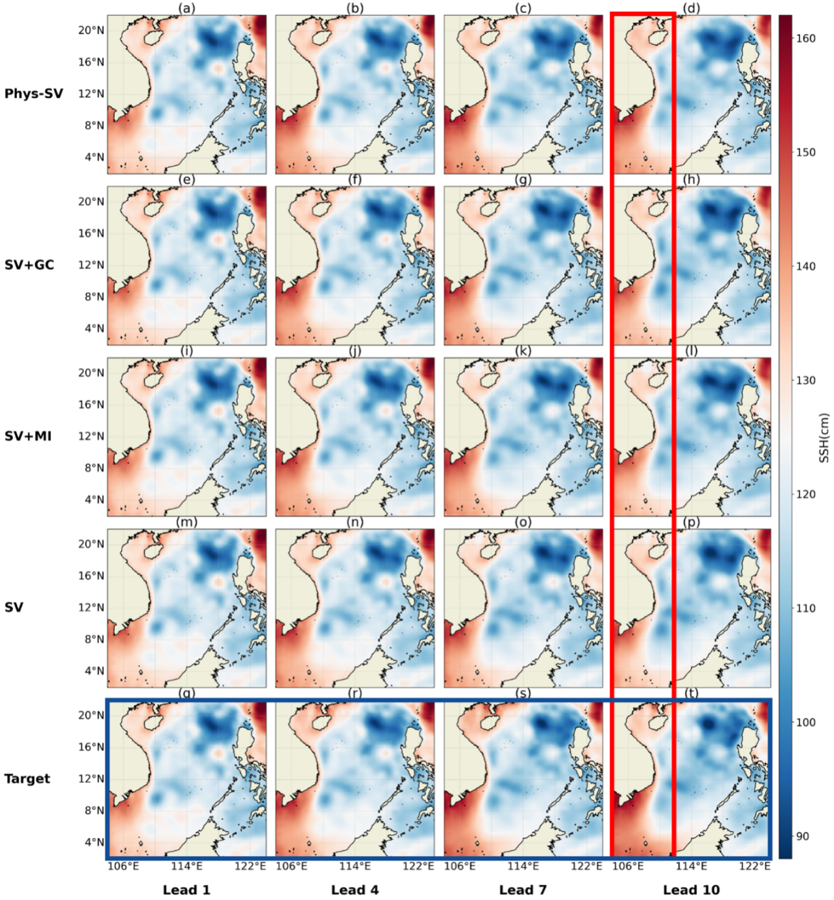
  <br>
  <em>Figure 10. SSH field comparison: Observation vs. Baseline vs. Mask-enhanced vs. Physics-informed prediction.</em>
</p>

<p align="center">
  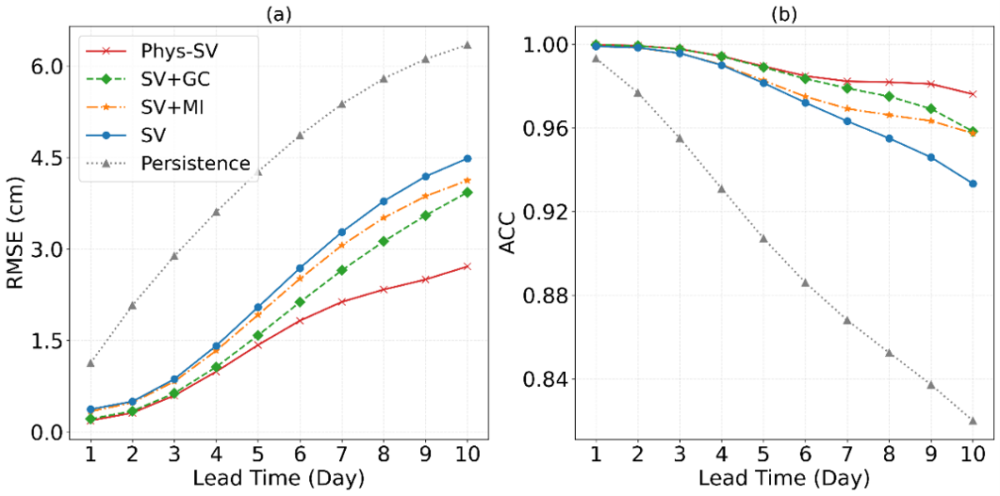
  <br>
  <em>Figure 11. Performance metrics during the case study period. Phys-SV (mask + geostrophic constraint) consistently achieves the best results.</em>
</p>

### Statistical Robustness

To confirm that the reported performance differences are not attributable to random chance, we employ a **bootstrap** resampling method (1000 iterations) to estimate 95% confidence intervals for all key results.

<p align="center">
  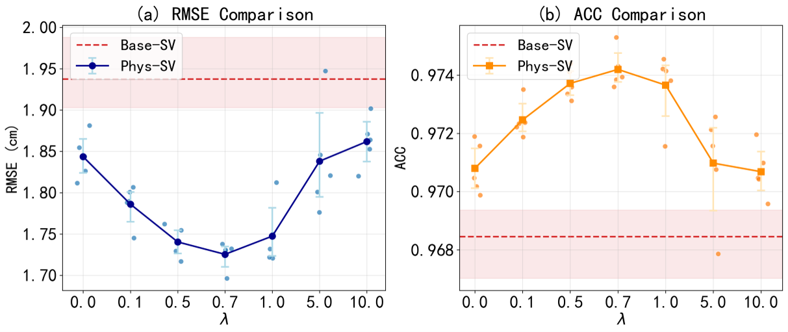
  <br>
  <em>Figure 12. SimVPv2 RMSE under different geostrophic constraint coefficients λ with 95% bootstrap confidence intervals. The shaded region indicates the confidence band; the optimal λ=0.7 lies well above the no-constraint baseline (λ=0), confirming the robustness of the improvement.</em>
</p>

<p align="center">
  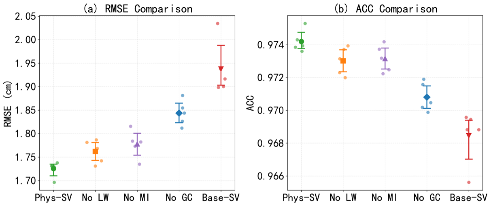
  <br>
  <em>Figure 13. Ablation study with bootstrap confidence intervals. The non-overlapping confidence bands between baseline and physics-informed variants confirm that the improvements from mask input and geostrophic constraint are statistically significant.</em>
</p>

---

## Training Configuration

| Item | Value |
|:-----|:------|
| Loss Function | MSE |
| Optimizer | AdamW (lr=1×10⁻⁴, weight_decay=1×10⁻⁴) |
| Batch Size | 4 |
| Max Epochs | 200 |
| Early Stopping | patience = 10 |
| Gradient Clipping | norm = 1.0 |
| LR Scheduler | ReduceLROnPlateau (factor=0.1, patience=5) |
| Random Seed | 42 |
| Hardware | NVIDIA RTX 4090 (24GB) |
| Software | PyTorch 2.5.1, Python 3.9.20 |

---

## Repository Structure

```
Sea-Surface-Height-Prediction-Using-different-Neural-Network-Frames
│
├── analyze/                 # Experimental analysis scripts
├── models/                  # Neural network model implementations
├── plotter/                 # Visualization tools
├── preprocess_data/         # Data preprocessing and sample generation
├── tools/                   # General training scripts

│
├── dataset.py               # Dataset definitions and data loading
├── iterable_dataset.py      # Iterable dataset implementation
├── configs.py               # Experiment configuration
├── train_linux.py           # Batch experiment launcher
├── test_coastal.py          # Model evaluation script
├── collect_test_info.py     # Collect testing information
├── mytools.py               # General utility functions
└── convert-py-md.py         # Documentation conversion utility
```

### Workflow

```
CMEMS SSH Data → preprocess_data/ → dataset.py → models/ → train_linux*.py → analyze/ + plotter/
```

---

## Quick Start

**Environment**

```
Python >= 3.9
PyTorch >= 2.0
CUDA >= 11.8
```

**Training**

```bash
python train_linux.py
```

---

## Citation

If this repository is useful for your research, please cite:

```bibtex
@article{huang2025investigation,
  title={Investigation of Physics-Informed Methods for Improving Sea Surface Height Prediction Based on Neural Networks in the South China Sea},
  author={Huang, Linxiao and Shu, Yeqiang and Yao, Jinglong},
  journal={Remote Sensing},
  volume={17},
  number={23},
  pages={3838},
  year={2025},
  publisher={MDPI}
}
```

---

## References

- **SimVPv2**: Tan C, Gao Z, Li S, et al. "SimVPv2: Towards Simple Yet Powerful Spatiotemporal Predictive Learning", *arXiv*, 2024
- **PredRNNv2**: Wang Y, Wu H, Zhang J, et al. "PredRNN: A Recurrent Neural Network for Spatiotemporal Predictive Learning", *IEEE TPAMI*, 2023, 45(2): 2208–2225
- **PredFormer**: Tang Y, Qi L, Xie F, et al. "Video Prediction Transformers Without Recurrence or Convolution", *arXiv*, 2025
- **Huang L, Shu Y, Yao J.** Investigation of Physics-Informed Methods for Improving Sea Surface Height Prediction Based on Neural Networks in the South China Sea. *Remote Sensing*, 2025, 17(23): 3838.
---

## Acknowledgements

This work was conducted at the South China Sea Institute of Oceanology, Chinese Academy of Sciences. Data support from Copernicus Marine Environment Monitoring Service (CMEMS).

---

## Contact

**Linxiao Huang** — Email: huanglinx@qq.com
